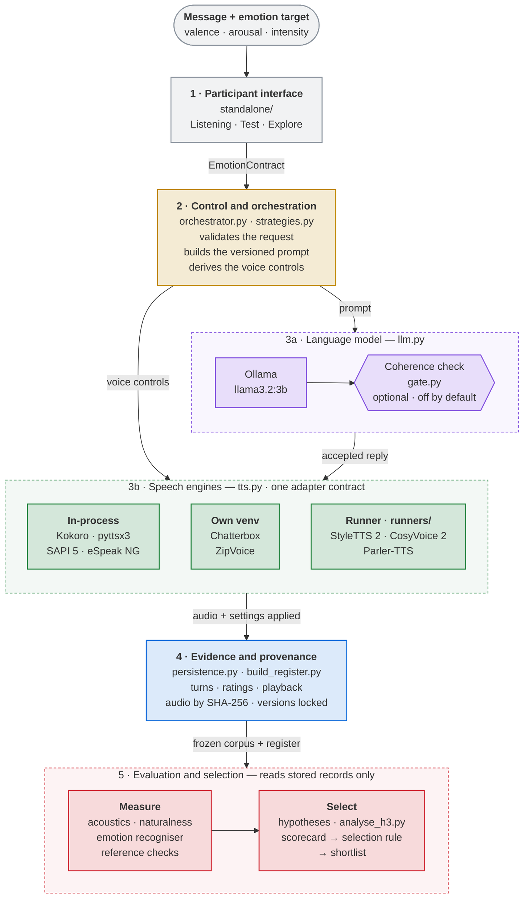

# ECHO — Emotionally Coherent Text-to-Speech Conversational System

Emotion-conditioned text **and** speech from one declared emotion. Give ECHO a message and an
emotion target on the valence–arousal plane; it writes a reply in that emotion with a local
language model, speaks it through one of nine open text-to-speech configurations set from the
same target, and logs the turn with the versions, settings and audio hash that produced it.
Local, open source, no cloud, no cost.

```
python demo.py "The meeting was moved to a different room" --all-quadrants
```
→ four replies (Happy / Upset / Sad / Calm), four spoken clips, four fully logged turns.

Code and evidence behind the Master in Data Science project report *Conversational System for
Generating Emotionally Coherent Responses in Text-to-Speech* (Oleksandr Harkavenko,
Politécnico de Leiria, 2026). Written for whoever picks it up next.

## What ECHO is

ECHO is a conversational voice AI system built around one idea: the emotion a user declares
should reach the listener in both the wording of the reply and the voice that speaks it. A
single emotion target on Russell's circumplex drives a local language model and nine open
speech engines through one control contract, and nothing downstream chooses the emotion again.

ECHO is also a research platform for evaluating emotional coherence in text-to-speech. It
holds a frozen 45-clip corpus, a blinded listening application, acoustic descriptors,
automatic emotion and naturalness instruments calibrated on natural speech, and a declared
procedure that ranks engines with different control surfaces on equal terms. The project used
it to show that emotion presets move perceived emotion towards the target, that arousal
transmits far more reliably than valence, and that automatic scores cannot yet stand in for
listeners. The same platform is ready for new engines, more sentences, larger panels and
studies of coherence in free conversation.

## Goal, objectives and questions

**Goal.** Build a conversational system in which a user-declared emotion reaches the listener
in both text and speech. English only; the emotion is declared before the conversation and
stays fixed; no model is trained; everything runs locally.

| # | Project objective | Where it lives |
|---|---|---|
| 1 | Review language models and text-to-speech with emotion | report, Chapters 2–3 |
| 2 | Map Russell's circumplex to vocal expressivity | `contracts.py`, `strategies.py`, `prompts/` |
| 3 | Web interface: message in, emotion chosen | `standalone/` |
| 4 | Language model generates the reply | `llm.py`, `gate.py` |
| 5 | Speech synthesis with controlled emotion | `tts.py`, `runners/`, `standalone/tts-service` |
| 6 | Evaluate coherence by automatic methods and listening tests | measurement scripts, Listening mode, `research/` |
| 7 | Rank the engines and select the best fit | `build_scorecard.py`, `research/scorecard_frozen45.csv` |

Five research questions sit behind objectives 6 and 7. In short: one declared emotion *can*
drive both channels traceably (RO2); coherence is measured as distance from the target after
blinded rating, against a matched neutral rendition (RO3); presets reduced target error, mostly
through arousal, with no overall naturalness cost established (RO4); a naturalness threshold,
then target error, then cost gives a shortlist of CosyVoice 2, Chatterbox and Kokoro under the
tested conditions (RO5). Automatic and listener rankings did not agree enough to replace
listeners. All of this rests on one sentence, four targets at one intensity, nine
configurations and eight listeners; the listening study validates the speech channel, not
coherence in free conversation.

## The four emotions

| Quadrant | Valence | Arousal | Label | Voice tendency (rate / level / pitch) |
|---|---|---|---|---|
| Q1 | +0.6 | +0.6 | Happy | fast, loud, higher |
| Q2 | −0.6 | +0.6 | Upset | fast, loud, slightly lower |
| Q3 | −0.6 | −0.6 | Sad | slow, soft, lower |
| Q4 | +0.6 | −0.6 | Calm | slow, soft, higher |

Rate and level follow arousal; pitch follows arousal and valence together. Intensity is fixed
at 0.7. These are engineering choices for non-extreme emotions, not calibrated values. Each
engine renders only the controls it exposes, and which ones actually respond is measured
(`report_controllability.py`), never assumed.

## Architecture



| Layer | Role | Code |
|---|---|---|
| 1 · Participant interface | Listening, Test and Explore; sends message + target | `standalone/` |
| 2 · Control and orchestration | Validates the request, builds the versioned prompt, derives the voice controls | `contracts.py`, `orchestrator.py`, `strategies.py` |
| 3a · Language model | Writes the reply; optional coherence check, off by default | `llm.py`, `gate.py` |
| 3b · Speech engines | Nine configurations behind one adapter contract | `tts.py`, `runners/` |
| 4 · Evidence and provenance | Turns, ratings, playback; audio by SHA-256; versions locked | `persistence.py`, `build_register.py` |
| 5 · Evaluation and selection | Measures stored audio, tests the hypotheses, applies the selection rule | measurement scripts, `analyse_h3.py`, `build_scorecard.py` |

Everything runs on one machine: Ollama serves the LLM at `localhost:11434`, engines are local,
`echo.db` is SQLite. The `openai` package is only a client for Ollama's compatible endpoint; no
text leaves the machine. Layer 5 reads stored records and never triggers generation. Three
seams must not change casually: `EmotionContract`, the two adapter interfaces, the provenance
schema (`ARCHITECTURE.md`).

## Layout

```
contracts.py  strategies.py  prompts/      emotion target → prompt + voice controls
llm.py  tts.py  gate.py  gate_service.py   adapters (Ollama, nine engines, mocks), coherence check
orchestrator.py  persistence.py  demo.py   one turn, its log, the CLI
config.py  .env.example                    every setting
runners/                                    scripts run inside an engine's own interpreter
synth_stimuli.py  build_register.py         corpus rendering, hash-locked register
report_controllability.py                   do the dials move?
analyze_acoustics_v2.py  naturalness.py     acoustics, predicted naturalness,
emotion_conveyance.py  check_instruments.py automatic emotion, instrument reference checks
analyse_h3.py  analyze_bridge.py            hypotheses, instrument–listener agreement
build_scorecard.py                          selection scorecard
research/                                   frozen data and outputs (one file per reported table)
standalone/                                 listening-study web app and deployments
tests/  standalone/tests/                   pytest and node suites, engines mocked
figures/                                    one script per report figure, and the figures
```

## Quick start

Python 3.10 or 3.11. For text generation, [Ollama](https://ollama.com).

```sh
git clone https://github.com/Solrosig/ECHO.git && cd ECHO
python -m venv .venv && source .venv/bin/activate     # Windows: .venv\Scripts\activate
pip install -r requirements.txt
pytest                                                # no model, engine or audio device needed
ollama pull llama3.2:3b
python demo.py "I lost my keys again" --all-quadrants
```

`--mock` runs the pipeline with nothing installed; `--engine` picks a voice; `--list-engines`
shows what this machine can run; `--judge` turns on the coherence check. Default branch is
`dev`; tag `v1.0` is the commit behind the report's numbers.

Settings are environment variables read by `config.py`; copy `.env.example` to `.env`.
The ones you will meet first: `ECHO_TTS_ENGINE`, `ECHO_ENGINE_SEED`, `ECHO_OLLAMA_MODEL`, and
`ECHO_<ENGINE>_PYTHON / _REPO / _MODEL_DIR / _REFS` for engines that live in their own venv.

## Tests

```sh
pytest                      # Python pipeline
cd standalone && pnpm test  # web app: catalogue, calibration, database, dialogue
```

Both suites mock models and engines at the adapter boundary and never assert on generated
content.

## From corpus to shortlist

The project's evidence pipeline, in the order it runs.

**1. Render and check.** One English sentence (`stimuli_eval.txt`), every configuration,
neutral plus four targets: 45 clips.

```sh
python synth_stimuli.py --engine espeak --param-set all --label espeak_check
python report_controllability.py          # does each requested change appear in the audio?
python synth_stimuli.py --engine espeak --param-set preset --label espeak_frozen
python build_register.py                  # verify every SHA-256, consolidate research/register.csv
```

Four of the six configurations first tried accepted pitch settings and did not render them.
That is why the check exists. Clips are level-normalised at corpus assembly, before hashing.

**2. Measure.** Three kinds of evidence on identical audio.

```sh
python analyze_acoustics_v2.py    # F0 in semitones, rate, pauses, voice quality; deltas from matched neutral
python naturalness.py             # UTMOS
python emotion_conveyance.py      # dimensional recogniser, valence and arousal per clip
python check_instruments.py       # both instruments on 80 natural RAVDESS clips
```

Every automatic value is read beside the instrument's reference performance on natural speech
(arousal 88.8 %, valence 48.8 %, Calm never recovered), so a low valence score alone never
tells synthesis failure from recogniser failure.

**3. Listen.** `standalone/` is the application the participants used. Node.js 24.

```sh
cd standalone
node scripts/setup.mjs       # once; prints the researcher password
node server/start.mjs        # http://127.0.0.1:8787/
```

Listening plays the frozen clips blinded and records valence, arousal, naturalness and target
match; the target is revealed only after the first ratings lock. Test synthesises a fixed
phrase live. Explore holds a conversation. Kokoro runs in the browser; the other four Python
voices need `standalone/tts-service` (GPU recommended). Every rating row stores study version,
calibration version and audio hash. Docker and Hugging Face deployments are in
`standalone/deployment/`; details in `standalone/README.md`.

**4. Test and select.**

```sh
python analyse_h3.py        # H1 presets reduce target error · H2 arousal > valence · H3 automatic vs listener ranking
python analyze_bridge.py    # acoustic separation against listener improvement, engine level
python build_scorecard.py   # naturalness ≥ 3.0 → rank by preset target error → cost tie-break
```

Conclusions are drawn from participants, not clips: one mean paired contrast each, percentile
bootstrap over participants, Holm-adjusted one-sided tests. The selection rule is applied
mechanically to the stored scorecard, so anyone can recover the same shortlist.

## Reproducing the report

Every table and figure in the Results chapter comes from one script reading `research/`.
Audio is never re-synthesised; each clip is checked against its hash first; `SEED = 666`.
Check out `v1.0` for the exact numbers.

| Report item | Command | Reads |
|---|---|---|
| Control fidelity, Table 5.8 | `report_controllability.py` | pre-corpus register |
| Acoustic separation, Table 5.9, Figures 5.2–5.3 | `analyze_acoustics_v2.py` | `register_frozen45.csv`, audio |
| Instrument reference performance, Table 5.7 | `check_instruments.py` | `instrument_ceilings/` |
| Automatic scores, Table 5.10 | `naturalness.py`, `emotion_conveyance.py` | frozen corpus |
| H1–H3, Tables 5.11–5.13 | `analyse_h3.py`, `analyze_bridge.py` | `listening/ratings_frozen45.csv` |
| Scorecard and selection, Tables 5.14–5.15 | `build_scorecard.py` | all of the above |
| Figures 4.1–4.7, 5.1–5.11, E.1 | `figures/make_figure_<n>.py`, or all at once `figures/make_all_figures.py` | `research/` |

`research/listening/ratings_frozen45.csv` holds the 360 anonymised trial-level ratings from
eight participants: participant code, trial order, clip hash, four ratings, replay count. No
timestamps, no identifiers. Superseded runs are in `research/archive/`.

## Integrating a new open TTS engine

An engine enters ECHO in two places, in this order: the Python pipeline, where it is measured
and frozen, then the web application, where listeners hear it.

**Before you start.** Three conditions have excluded candidates before (Table 4.10 of the
report): the licence allows research use and redistribution of outputs; code and weights can
be pinned to a revision; the engine exposes at least one control an emotion target can be
mapped to. Pick the mechanism, and the base class follows.

| Mechanism | Base class in `tts.py` | Example |
|---|---|---|
| Explicit prosody markup | `TTSAdapter` | `EspeakNgAdapter`, `Sapi5XmlAdapter` |
| Native rate, external pitch and level | `TTSAdapter` | `KokoroAdapter` |
| Reference or style conditioning | `TTSAdapter` / `SubprocessTTSAdapter` | `ChatterboxAdapter`, `StyleTTS2Adapter` |
| Natural-language instruction | `InstructionTTSAdapter` | `CosyVoice2Adapter`, `ParlerTTSAdapter` |

**Python pipeline**

1. *Environment.* Own venv if the engine pins its own torch. Add `ECHO_<NAME>_PYTHON`,
   `_REPO`, `_MODEL_DIR` (and `_REFS`) to `.env.example`. No command line? Write
   `runners/<name>_run.py` to the contract in `runners/README.md`.
2. *Adapter.* Subclass in `tts.py`. Return audio path, duration, SHA-256, the settings
   *actually applied*, engine identity and revision. Never report a control the engine
   ignores. Pin the revision; never "latest".
3. *Mapping.* In `strategies.py`, map only to controls the engine renders. Reference engines
   get one clip per quadrant plus neutral, with provenance recorded
   (`standalone/tts-service/refs/provenance.json` shows the format). Instruction engines get
   their four wordings in `prompts/`, as data.
4. *Register and test.* `config.py`, `--engine` in `demo.py`, `tests/test_<name>.py` with the
   engine mocked. `pytest` must pass without the engine installed.
5. *Prove the dials move.* `synth_stimuli.py --param-set all`, then `report_controllability.py`.
   An unrendered control does not go forward.
6. *Freeze.* `synth_stimuli.py --param-set preset`, `build_register.py`, then the three
   measurement scripts, so the engine has a scorecard row before anyone listens.

**Web application**

7. *Speech service.* Add a branch to `load_engine()` and `render()` in
   `standalone/tts-service/models.py`, pin weights in `models.lock.json`, references in
   `tts-service/refs/`, call `/api/tts` once by hand. Browser-only engines go in
   `model-sources.json` with URL, revision, size and SHA-256 per file.
8. *Catalogue and calibration.* `engine-catalog.js`: add the key to `ENGINE_NAMES` and to the
   activities it may join. `calibration-profiles.js`: `native()` or explicit `rate`, `gain`,
   `pitch_semitones`; bump `CALIBRATION_VERSION`.
9. *Study manifest.* Copy the frozen clips to `public/study/audio/`, list them in a **new**
   manifest with a new `study_version`, register it in `server/worker.js`. A manifest with
   responses is never edited; cohorts never mix.
10. *Dry run.* `pnpm test`, then one Listening session as a technical test: 45-of-45 receipt,
    and the stored rows carry the new engine, calibration version and hash.

Write it down: a row in Appendix F and in the register, and the reason for admission and the
controllability result in the session's `SESSION.md`. An engine that fails step 5 is still
worth recording.

## Where to continue

In the order the report gives, because the first two decide how far the rest can be trusted:

1. More material: sentences, voices, seeds, targets between the anchors, intensities near
   neutral. The register and audio store already support it.
2. A larger listener panel with practice trials, attention checks and prior-exposure
   screening applied consistently.
3. More models per control mechanism, with rendering verified before trust.
4. Generated conversation: relevance, target fidelity and text–voice agreement rated
   separately. Explore mode exists; matched neutral renditions for it do not.
5. A latency ceiling in the selection rule; no live configuration synthesised faster than
   real time.
6. Shared versus channel-specialised control: valence on wording, arousal on speech.

## Data and ethics

Participants were adult volunteers who consented to research use of their anonymised
ratings. Published ratings carry no names, timestamps or session identifiers. RAVDESS clips
and the Warriner et al. affective norms (`BRM-emot-submit.csv`) are used under their original
terms; see `research/SOURCES.md`.

## Citation

```
Harkavenko, O. (2026). ECHO: Emotionally Coherent Text-to-Speech Conversational System
(v1.0) [Computer software]. GitHub. https://github.com/Solrosig/ECHO
```

## Licence

MIT. Each engine keeps its own licence (Appendix F of the report); eSpeak NG is GPL-3.0 and
runs as a separate process.
